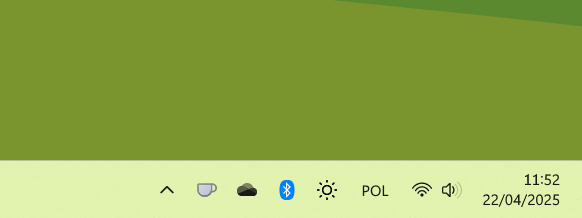

# OneDrive Better Light Mode

Using Powershell script and Resource Hacker, apply different set of OneDrive tray icons, to resemble macOS design for light mode.

    

## How to

- clone repository locally
- run _EasyLauncher.bat_ to install new icons
- run _EasyLauncher.bat -u_ to restore default icons

## Important notes

Keep in mind, that icon replacement is not permanent! Every OneDrive update will revert those icons to default, so the script would need to be re-run once OneDrive will be updated.

## Future plans
- &#x2610; more light mode tray icons
- &#x2612; remove Windows 10 folder from default OneDrive icon
